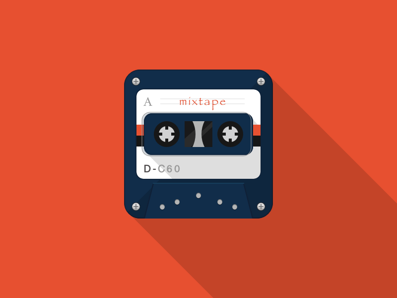
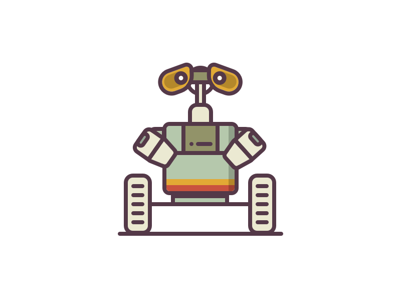
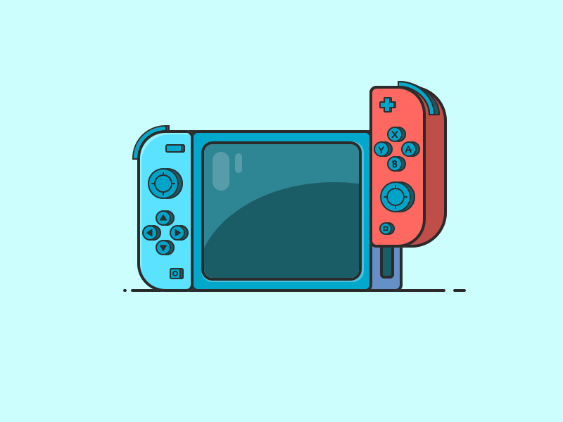

看了一篇文章关于设计的文章 —— [为什么我临摹了很多设计作品，还是没办法原创](https://www.uisdc.com/copy-not-lead-to-original#loopNav)，以自己一点皮毛的 UI 经验感觉言之有理，所以开一个仓库来专门临摹别人的作品。

## 20180711-时钟图标

**临摹来源：** [用sketch制作一个时钟图标](http://www.ui.cn/detail/102863.html)

**站酷链接：** https://www.zcool.com.cn/work/ZMjg5NTM0MjA.html

## 20180712-药瓶图案

**临摹来源：** [来绘制一个简单有趣的药瓶【sketch】](http://www.xueui.cn/tutorials/sketch-interesting-bottle.html)

**站酷链接：** https://www.zcool.com.cn/work/ZMjg5NzY1MzY.html

## 20180713-小鸟图标

**临摹来源：** [酷九合金社Sketch教程系列-小鸟图标](https://www.zcool.com.cn/article/ZODU0MzY.html)

**站酷链接：** https://www.zcool.com.cn/work/ZMjg5OTkwMDQ.html

## 20180720-水滴图标

**临摹来源：** [使用Sketch 3设计水滴图标](http://www.ui.cn/detail/34282.html)

**站酷链接：** https://www.zcool.com.cn/work/ZMjkxMzE0NjA.html

**临摹来源：** [Sketch原创卡通形象—愤怒的河豚](http://www.ui.cn/detail/191138.html)

**站酷链接：** https://www.zcool.com.cn/work/ZMjkyMDY4NDg.html

**临摹来源：** [简约磁带图标教程](http://www.xueui.cn/tutorials/other-tutorials/cidai.html)

**站酷链接：** https://www.zcool.com.cn/work/ZMjkyMTYxMDQ.html

## 20180726-机器人瓦力

**临摹来源：** [教程-瓦力](http://www.xueui.cn/tutorials/walli_course.html)

**站酷链接：** https://www.zcool.com.cn/work/ZMjkyNDk4OTI.html

## 20180727-渐变的MBE

**临摹来源：** [插画教程——发光的“球球“](http://www.ui.cn/detail/212925.html)

**站酷链接：** https://www.zcool.com.cn/work/ZMjkyNjk2OTI.html

# 20180728-Switch游戏机

**临摹来源：** [Switch教程](http://www.xueui.cn/tutorials/switch180111.html)